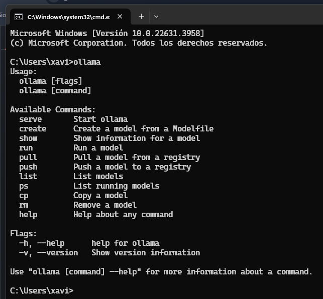
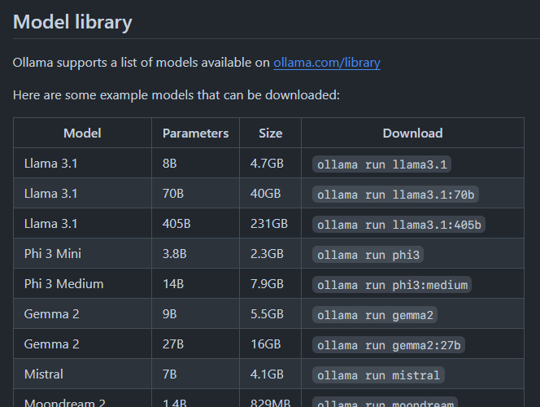
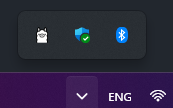

# Ollama: Instalación local

Ollama es una biblioteca de inteligencia artificial que permite interactuar con modelos de lenguaje.

## Requisitos

Antes de comenzar, asegúrate de tener los siguientes requisitos:

- Python 3.x instalado en tu sistema
- pip instalado en tu sistema

## Instalación

1. Ir a https://ollama.com/download

2. descargar e instalar el .exe

3. ingresar por cmd y ejecutar ollama
    

4. Elegir que model instalar, por ejemplo 'ollama run llama3.1' (esto es dependiendo de la maquina)
    

5. Listo para usar despues de visualizar el icono de ollama 
   

## fuentes y material de apoyo
- https://github.com/ollama/ollama
- https://hackernoon.com/es/como-usar-ollama-practicamente-con-llms-locales-y-construir-un-chatbot
- https://www.youtube.com/watch?v=yM09dcOHAsA